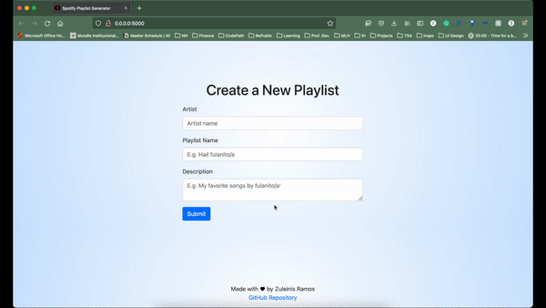

# Playlist-Aid
 A web app that uses Spotify's Web API to generate playlists based on users saved tracks by an artist.

## Walkthrough



GIF created with [ezGIF](https://ezgif.com/).

How to Use
---

### 1. Access Spotify's Developer Dashboard 
and create an App to get your own client credentials
https://developer.spotify.com/dashboard/

### 2. Fork and Clone this repository

### 3. Create a virtual enviroment 
https://docs.python.org/3/library/venv.html

### 4. Install requirements
```
pip install -r requirements.txt
```

### 5. Write your credentials in a .env file
```
client_ID='example'
client_SECRET='example'   
redirect_url='example'
```

### 6. Run Flask by running this command
```
flask run
```

